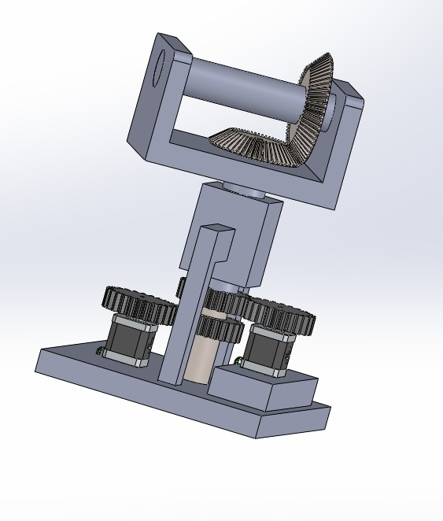
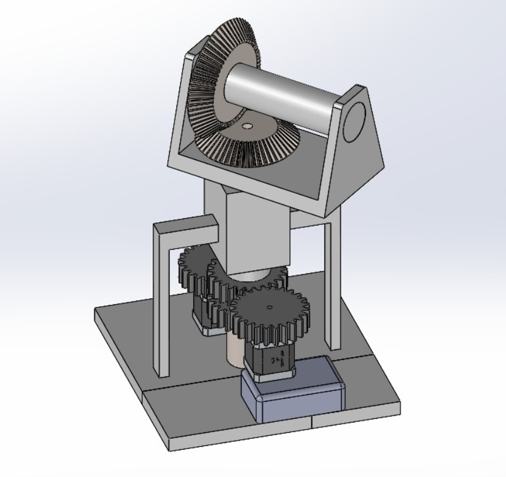
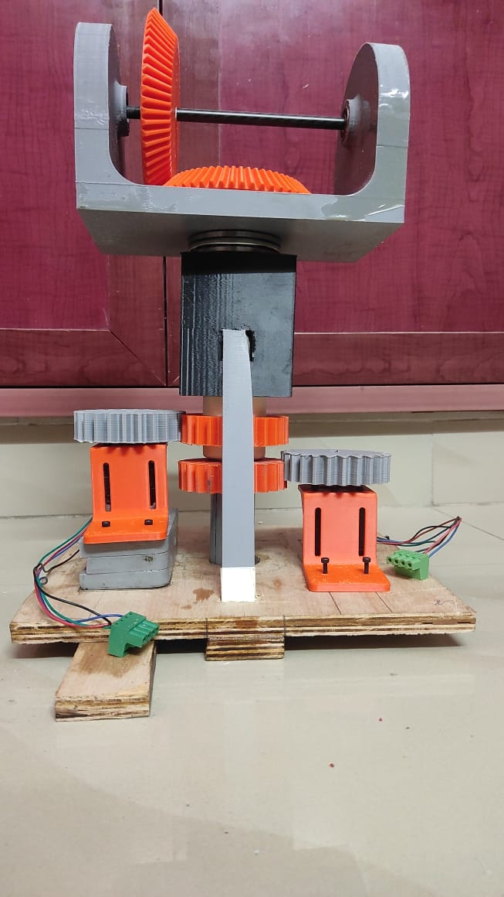
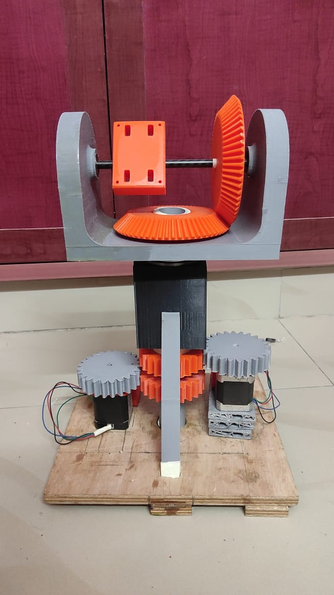
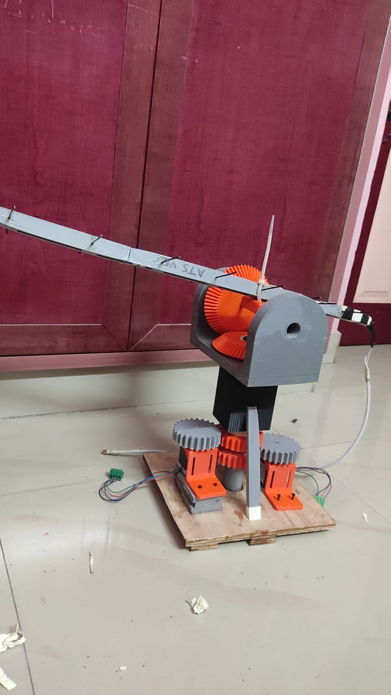
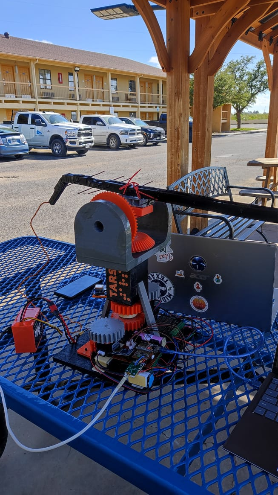

# TARS – Tracking Antenna Reception System

TARS (Tracking Antenna Reception System) is a low-cost, modular, GPS-based antenna tracking system designed to track high-powered rockets and UAVs in real-time using directional antennas. Built with ESP32, stepper motor control, and LoRa-based telemetry, TARS calculates azimuth and elevation angles from received GPS data and precisely orients a directional antenna toward the moving target.

---

## 🚀 Project Overview

### 🎯 Objective
To create a ground-based system that autonomously orients a directional antenna toward an airborne target using GPS coordinates, ensuring consistent and reliable reception of live telemetry data during rocket flights.

---

## 📡 Core Features

- **Real-Time Antenna Tracking** using received GPS coordinates.
- **Dual-Axis Rotation** with NEMA 17 stepper motors (azimuth and elevation).
- **Mechanically-Coupled Axis Compensation** for accurate motion.
- **Telemetry Reception & Parsing** over LoRa + ESP32.
- **Antenna Direction Logic** using Haversine and elevation computation.
- **Data Logging** via microSD.
- **Fully 3D-Printed Mechanical Design** (lightweight, customizable, low-cost).
- **Modular & Portable** with independent power systems.

---

## 🛠️ System Architecture

### 🛰️ Transmitter (Rocket Avionics)
- **ESP32**: Controls telemetry packet formation.
- **GPS Module**: Outputs live latitude, longitude, altitude, speed, and time.
- **MPU9250 IMU**: Provides roll, pitch, and yaw angles with acceleration and gyro data.
- **HMC5883L Magnetometer**: Provides compass heading.
- **LoRa SX1278 Module**: Sends telemetry data to ground station.

---

###  Ground Station (Receiver & Tracker)
- **ESP32**: Receives and parses telemetry packets; calculates pointing angles.
- **LoRa SX1278**: Receives telemetry from the rocket.
- **Yagi-Uda Antenna (3D Printed)**: Directional reception, connected via RF amplifier.
- **0.1–2000 MHz RF Wideband LNA Module (Gain: 30 dB)**: Amplifies received signals.
- **Two NEMA 17 Stepper Motors**: Drive azimuth and elevation axes.
- **Two TB6600 Motor Drivers**: Connected to ESP32 via prototype board for motion control.
- **microSD Card Module**: Stores all parsed telemetry.
- **Power**:
  - Motors and drivers: 14.8V, 4000mAh Li-ion battery pack.
  - Prototype board: 3.7V Li-ion battery.
- **Mechanics**:
  - All gears and structural components 3D-printed.
  - Lightweight and reliable for outdoor use.

---

## 🧠 Software Functionality

### 📐 Angle Computation Algorithm
- Parses GPS `lat`, `lon`, `alt` from received packets.
- Calculates:
  - **Azimuth** using Haversine and bearing formulas.
  - **Elevation** using relative altitude and ground distance.
- Applies coupling correction for the elevation mechanism affected by azimuthal rotation.

### 📦 Telemetry Packet Format
Each packet includes:
- Unique ID & packet count
- GPS: Latitude, Longitude, Altitude, Speed, Satellite Count, Time
- IMU: Acceleration, Gyroscope
- Magnetometer: Compass heading
- Orientation: Roll, Pitch, Yaw

---

## 🔌 Hardware Summary

| Component                    | Description                            |
|------------------------------|----------------------------------------|
| ESP32 (x2)                   | Controls both transmitter and receiver |
| NEMA 17 Stepper Motors (x2)  | For Azimuth and Elevation rotation     |
| TB6600 Stepper Drivers (x2)  | Motor control via ESP32                |
| LoRa SX1278 Modules (x2)     | Long-range wireless communication      |
| microSD Module               | Data logging on ground                 |
| 14.8V 4000mAh Li-ion Battery | Powers motors and driver circuitry     |
| 3.7V Li-ion Battery          | Powers prototype board and ESP32       |
| LNA Module (30 dB Gain)      | Amplifies antenna signal               |
| 3D-Printed Yagi-Uda Antenna  | Directional tracking antenna           |
| 3D-Printed Gears & Mounts    | Lightweight, fully custom structure    |

---

## 🖥️ Software Tools Used

- **Arduino IDE**: Firmware development for ESP32.
- **Python**: For simulations, offline parsing, or testing.
- **Fusion 360 / SolidWorks**: CAD for mechanical design and gear systems.

---

## 📸 Visuals

### 🔧 CAD Model

|  |  |
|---------|---------|
|  |  |

---

### 🧩 TARS Early Assembly Process

| Stage 1 | Stage 2 | Stage 3 |
|---------|---------|---------|
|  |  |  |

---

### 🧷 TARS Final

---

## 📹 Test Video

[📹 TARS Initial Test ](media/TARS_testing_video.mp4)

---

## 📄 License

This repository is made public **for educational and portfolio showcasing purposes only**.

> Unauthorized copying, commercial use, or redistribution of any part of this work is strictly prohibited.  
> If you wish to build upon this project, please contact the author for permission.

Licensed under the [Creative Commons Attribution-NonCommercial-NoDerivatives 4.0 International License](https://creativecommons.org/licenses/by-nc-nd/4.0/).

---

## 👨‍💻 Author

Developed by **Ranjith Sharan J**  
Electronics & Instrumentation Engineering, VIT Vellore  
Senior Avionics Member, Team Sammard  
📧 Email: jranjithsharan@gmail.com

---

